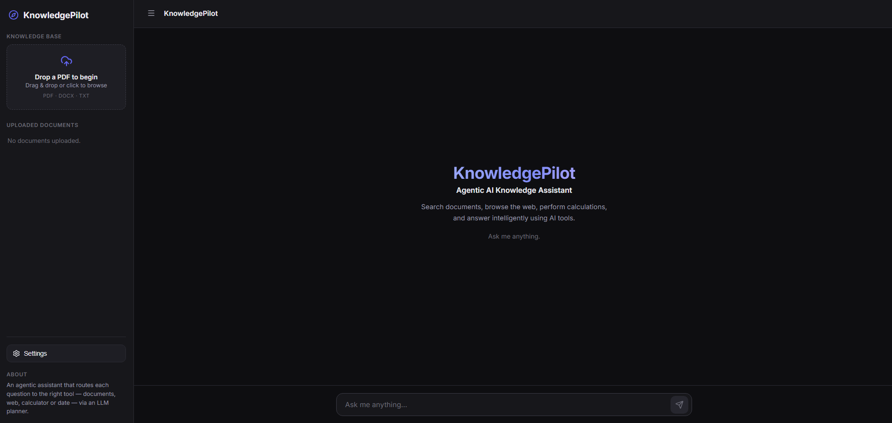
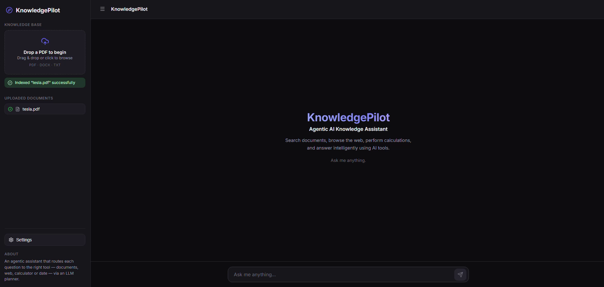
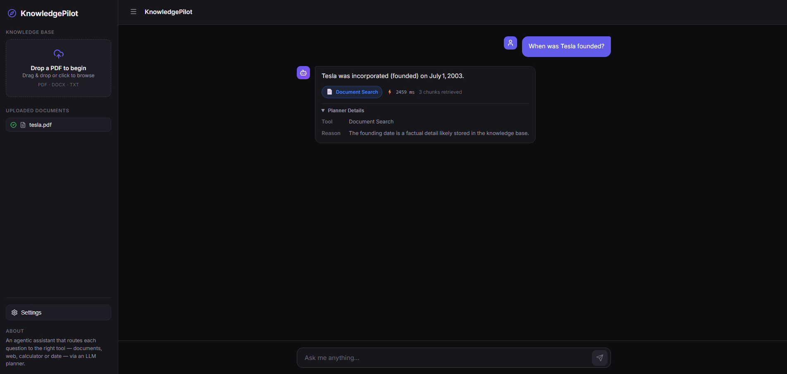
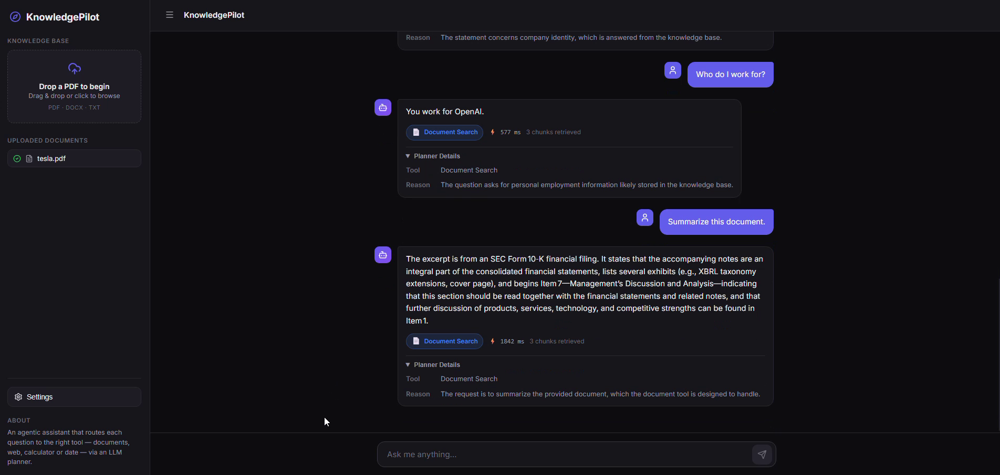
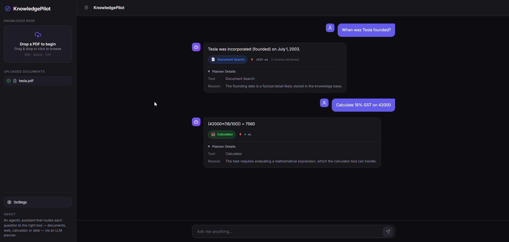
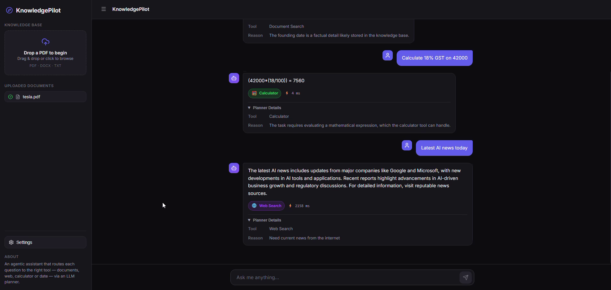
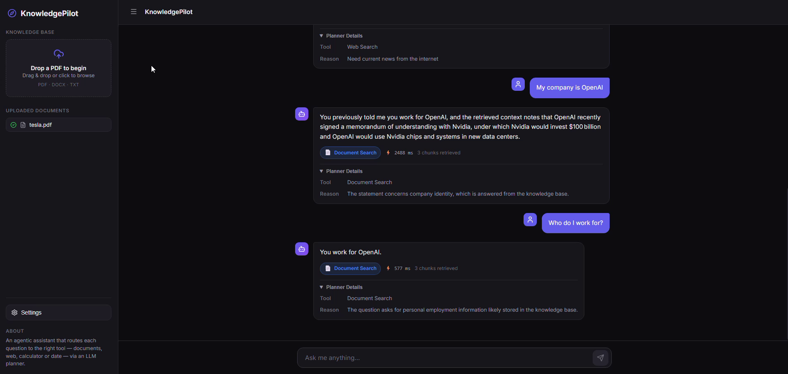

# 🚀 KnowledgePilot

### Agentic AI Knowledge Assistant

> An intelligent AI assistant that routes every user query to the most
> appropriate tool using an LLM-powered planner and a modular execution
> engine.

------------------------------------------------------------------------

## 📸 Project Preview

### Home



### System Architecture


### Workflow


------------------------------------------------------------------------

## ✨ Features

-   🧠 LLM Planner
-   ⚙️ Tool Executor
-   📄 RAG Document Search
-   🌐 Web Search
-   🧮 Calculator
-   📅 Date & Time
-   💾 Conversation Memory
-   📂 PDF/DOCX/TXT Upload
-   📚 Multi-document Knowledge Base
-   ⚡ Execution Metadata

------------------------------------------------------------------------

## 🏗 Architecture


The backend uses an LLM planner to select the best tool for each query.
The chosen tool executes independently and returns a structured response
with metadata.

------------------------------------------------------------------------

## 🔄 Workflow


1.  Upload a document.
2.  Index it into Qdrant.
3.  Ask a question.
4.  Planner selects the best tool.
5.  Tool executes.
6.  Answer is returned.

------------------------------------------------------------------------

## 🛠 Tech Stack

  Layer        Technology
  ------------ ------------------------
  Frontend     React + Vite
  Backend      Node.js + Express
  AI           LangChain + OpenRouter
  Vector DB    Qdrant
  Embeddings   Xenova MiniLM
  Search       Tavily
  Documents    Mammoth + Multer

------------------------------------------------------------------------

## 📂 Project Structure

``` text
agent/
frontend/
services/
tools/
docs/
server.js
package.json
```

------------------------------------------------------------------------

## 🖼 Screenshots

### Home


### Upload & Index



### Planner



### Document Search



### Calculator



### Web Search



### Conversation Memory



------------------------------------------------------------------------

## ⚙️ Installation

``` bash
git clone https://github.com/ArjunGali/KnowledgePilot.git
cd KnowledgePilot
npm install
cd frontend
npm install
```

Create a `.env` file:

``` env
OPENROUTER_API_KEY=YOUR_KEY
OPENROUTER_MODEL=nvidia/nemotron-3-nano-omni-30b-a3b-reasoning:free
QDRANT_URL=http://localhost:6333
TAVILY_API_KEY=YOUR_KEY
```

------------------------------------------------------------------------

## ▶️ Run

Backend

``` bash
node server.js
```

Frontend

``` bash
cd frontend
npm run dev
```

------------------------------------------------------------------------

## 🔮 Future Improvements

-   Multi-step planning
-   Persistent memory
-   Authentication
-   Streaming responses
-   More AI tools

------------------------------------------------------------------------

## 👨‍💻 Author

**Arjun Gali**

Portfolio project demonstrating Agentic AI, RAG, and intelligent tool
routing.
